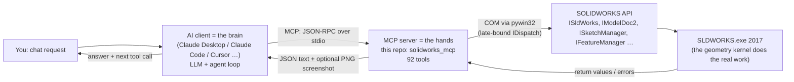

# How an AI drives SOLIDWORKS: the stack, the "brain", and how it draws

This is a learning doc for Zach. It goes from the chat window down to SOLIDWORKS and back, explaining what happens at each layer and where you can influence the AI's behavior.

## 1. The five layers

- **The brain** is the language model inside the client. It never touches SOLIDWORKS directly. All it can do is choose to call a tool and read what comes back.
- **The hands** are this MCP server, a small Python program the client starts as a subprocess. Each tool is a Python function that makes a handful of SOLIDWORKS API calls.
- **SOLIDWORKS** does all the actual geometry. The AI never computes a fillet; it asks SOLIDWORKS to make one.

## 2. What happens when a client connects
1. **The client launches the server.** It runs `.venv\Scripts\solidworks-mcp.exe` and talks to it over stdin/stdout. There's no network involved.
2. **`initialize`.** The two sides exchange protocol versions and names. This is where the server *could* send `instructions`, which become part of the model's system prompt. Ours currently sends none; ADR-0004 changes that.
3. **`tools/list`.** The server returns all 92 tools. Each one has a **name**, a **description** and a **JSON Schema** for its arguments. To the model they look like functions it may call. The descriptions are the main way the model knows when and how to use each tool, so they matter a lot.
4. From then on, each tool use is a **`tools/call`**:
   - the client sends the tool name and arguments
   - `server.py` looks up the handler in `sw_core.HANDLERS` and runs it
   - the server returns JSON text, plus a PNG image if the tool captured one

## 3. How the AI "draws"
The AI doesn't move a mouse or click toolbar buttons. It issues **parametric commands with numbers**, the same way a VBA macro does:
- "start a sketch on Front Plane"
- "corner rectangle from (−25, −15) to (25, 15) mm"
- "extrude 10 mm blind"

The server converts millimetres and degrees to SOLIDWORKS's internal **metres and radians** once, at the boundary.

**Worked example:** *"Make a 50×30×10 mm block with a Ø10 through-hole in the middle."* A typical sequence:

| Brain decides… | MCP tool | SOLIDWORKS API underneath (typical) |
|---|---|---|
| Is SW there? | `solidworks_status` | `GetActiveObject("SldWorks.Application")`, `RevisionNumber` |
| New part | `create_new_document` | `GetUserPreferenceStringValue` (default template) → `ISldWorks.NewDocument` |
| Sketch on Front Plane | `create_sketch` | `IModelDocExtension.SelectByID2("Front Plane", "PLANE", …)` → `ISketchManager.InsertSketch` |
| Rectangle centered on origin | `draw_rectangle` | `ISketchManager.CreateCornerRectangle` (metres) |
| Lock the size | `add_dimension` | `IModelDocExtension.AddDimension`, with the "Modify" dialog suppressed |
| Finish sketch, extrude 10 mm | `close_sketch`, `boss_extrude` | `InsertSketch` (toggle off) → `IFeatureManager.FeatureExtrusion3` (~23 arguments) |
| Hole | `create_sketch` on the face, `draw_circle`, `cut_extrude` (through all) | `CreateCircleByRadius` → `IFeatureManager.FeatureCut4` |
| Did it work? | `get_mass_properties`, `list_features` | `IModelDocExtension.GetMassProperties2` → volume should be ≈ 14 214.6 mm³ |
| Show me | `capture_screenshot` | Saves a picture of the viewport; the PNG goes back to the model, which can "see" it |

`docs/reference/tool-catalog.md` has the exact arguments and side effects of every tool.

**The key insight: the AI is effectively blind between tool calls.** It only knows what the tools tell it, through return values, list and measure tools, and screenshots. So it succeeds when it does two things:
1. **Plans** before acting: design intent, datums, feature order.
2. **Verifies** after acting: measure volume, count bodies, check rebuild errors.

Rules R-001 and R-005 exist for exactly this reason.

## 4. Where the "brain" can be shaped, from weakest to strongest
1. **Your prompt.** What you ask in the chat, every time.
2. **Client-side files.** `CLAUDE.md` or a Claude skill. These only reach that one client.
3. **Server `instructions`.** Sent at handshake to every client; ideal for a short core rule summary.
4. **Tool descriptions.** The model reads them whenever it considers a tool, which makes them very influential.
5. **MCP prompts.** Named workflows you invoke, e.g. `plan_part` walks the model through a build-plan template.
6. **MCP resources.** Documents the model can pull in, e.g. the full rulebook.
7. **Hard gates in tool code.** The tool refuses, e.g. "no build plan recorded yet". This is the only level the model can't talk its way past.

ADR-0004 proposes using levels 3, 5, 6 and 7 so your rules (plan-first, top-down vs bottom-up, …) apply in **any** AI client, with hard gates reserved for rules a program can check.

## 5. Why automation breaks, and what this server already does about it
- **Late binding ambiguity.** pywin32 talks to SOLIDWORKS without a compiled interface definition. Many SW members are declared as "properties that take arguments", and pywin32 sometimes calls them with *no* arguments by accident. Depending on the member, SW silently returns None or crashes. The fix is `sw_core.flag_methods(...)`, which tells pywin32 explicitly that the member is a method.
- **ByRef / typed arguments.** Some calls return error codes through "by reference" parameters, or need typed arrays or a typed null. That's what the `byref_long()`, `double_array()` and `nothing()` helpers are for.
- **Modal dialogs.** If SOLIDWORKS pops up a dialog (e.g. the dimension "Modify" box), the COM call blocks until a human closes it, and the server hangs. Tools turn such options off and restore them afterwards (`dimension_dialog_suppressed`).
- **Selection state.** Many SW operations act on "whatever is selected". Tools select by name (`SelectByID2`) right before acting. Names like "Front Plane" are **language-specific**, which is fine on an English install.
- **One SOLIDWORKS, one thread.** COM calls into SW are effectively serialized. Two agents driving SW at once will collide, which is why live testing is serial (ADR-0003).
- **Versions.** Newer SW versions add numbered API variants (`SaveAs3`, `CreateMassProperty2`). Code that calls one of those fails on 2017. `tools/compat/sw2017_api_members.txt` is the list of what 2017 actually has (ADR-0002).

## 6. Glossary
- **COM:** Windows' object protocol. SOLIDWORKS exposes its API through it.
- **ProgID / CLSID:** the human-readable name (`SldWorks.Application.25`) and the GUID that COM resolves it to.
- **Type library (`sldworks.tlb`):** the machine-readable list of every interface, method and enum. Our compatibility check reads it.
- **Late vs early binding:** looking up members by name at runtime (what pywin32 does here) versus using pre-generated wrappers.
- **MCP:** Model Context Protocol, the standard way AI clients discover and call external tools. A server offers **tools** (actions), **resources** (readable documents) and **prompts** (reusable workflows).
- **Agent loop:** the brain's cycle of think → call tool → read result → think again, repeated until it's done or needs you.
